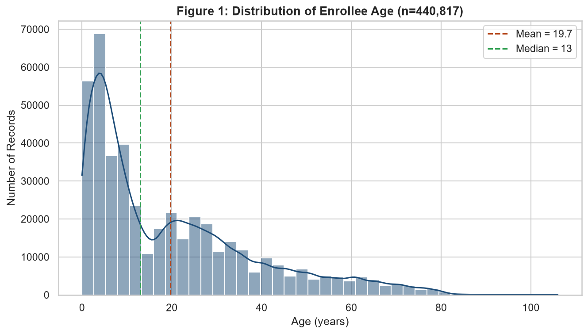
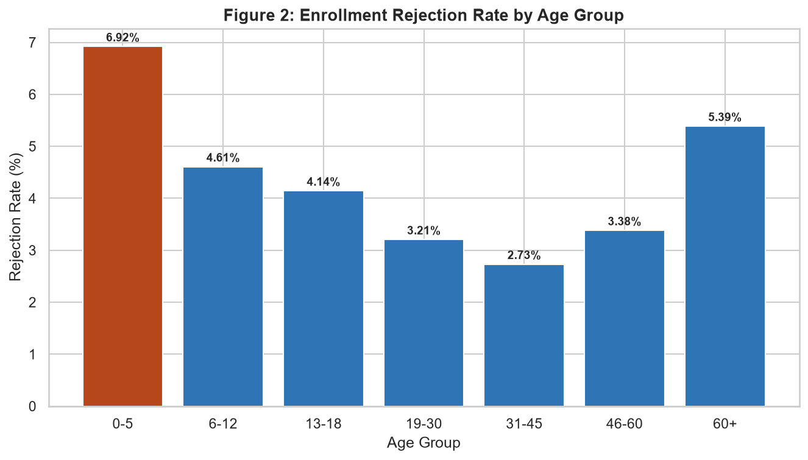
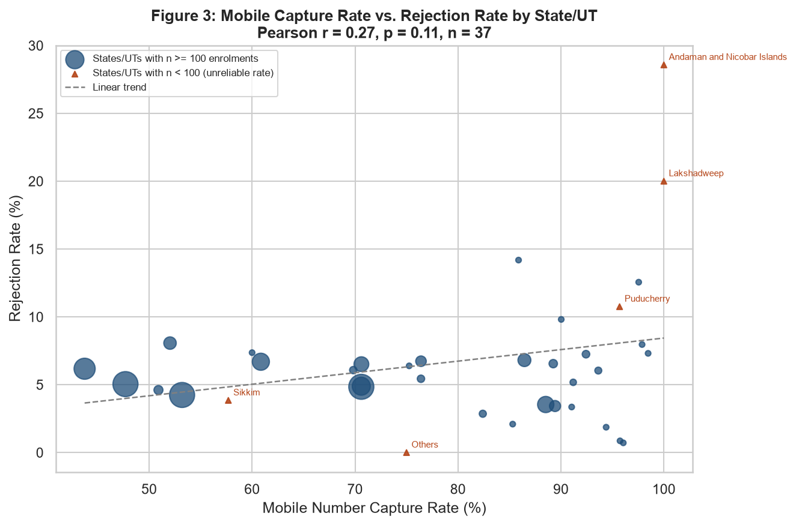
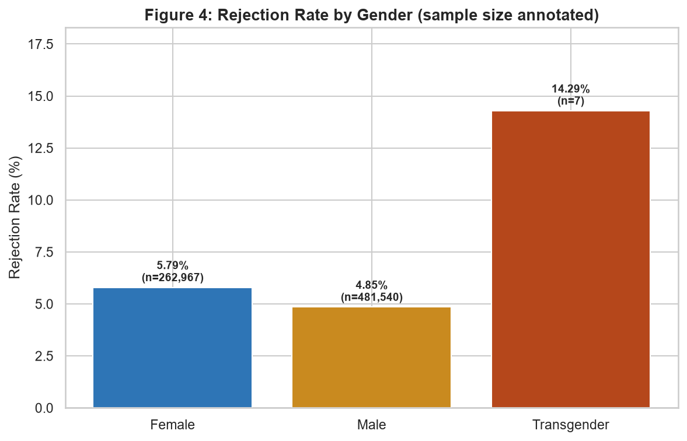
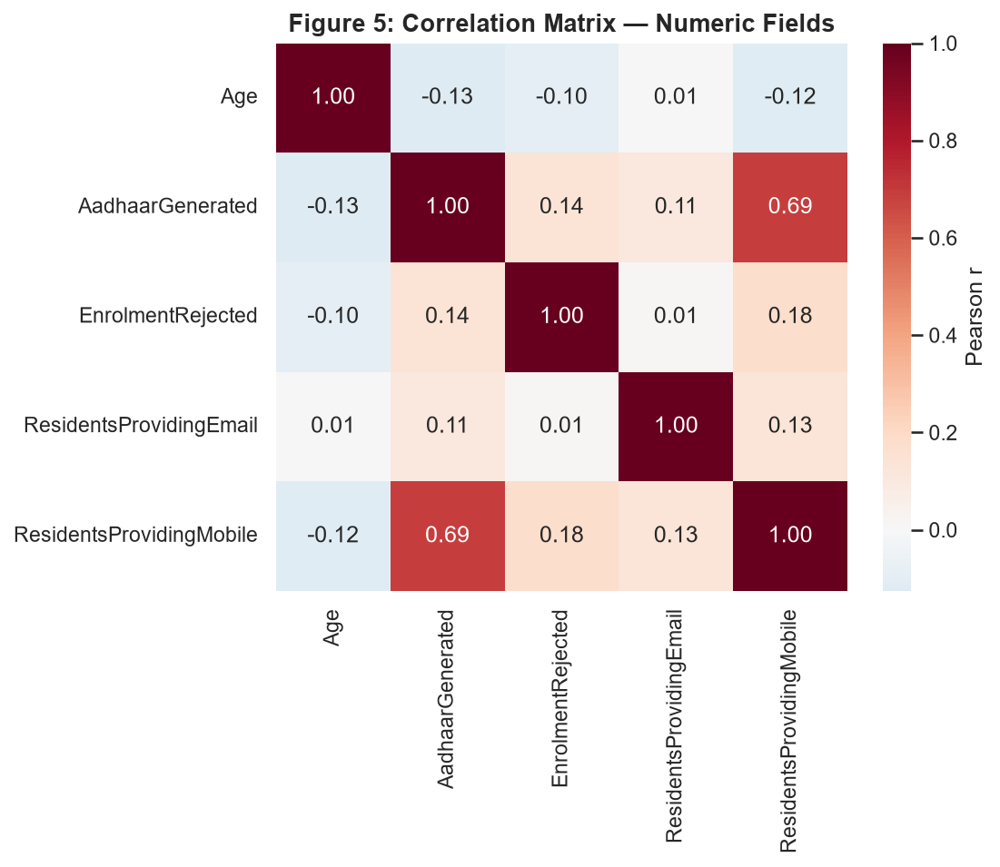
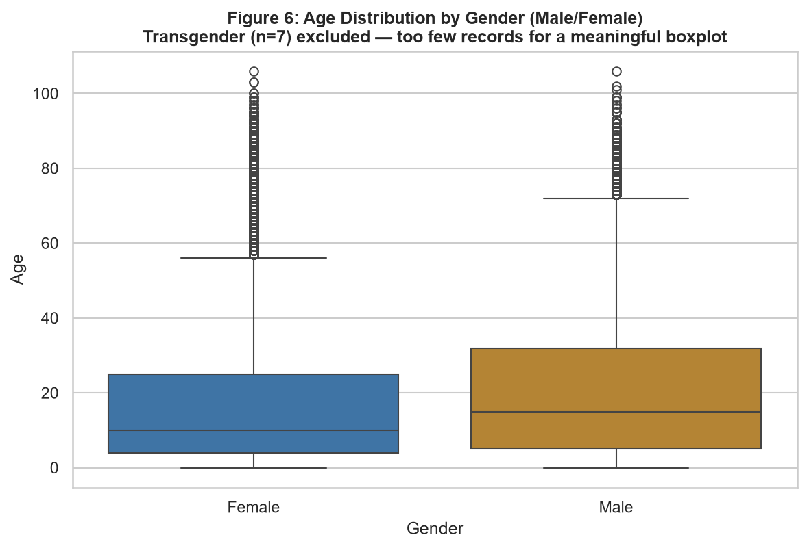

<div align="center">

# 🔍 Aadhaar Enrollment EDA
### Uncovering the Patterns Behind India's Digital Identity Data

*Where does India's Aadhaar enrollment process actually break down — and does it break down for the reasons you'd assume?*


-orange)

**[📓 Notebook](03_uidai_eda_visualization.ipynb) · [📊 Live Dashboard](index.html) · [📄 Full Report](Week3_EDA_Visualization.docx)**

</div>

---

## ✨ What is this project?

A rigorous, hypothesis-driven exploratory data analysis of **440,817 Aadhaar enrollment records**
published by the **Unique Identification Authority of India (UIDAI)** — India's digital identity
system and the foundation layer of its entire e-governance stack (DigiLocker, UMANG, direct
benefit transfer, and e-KYC all sit on top of it).

Rather than just "make some charts," this project **formulates 4 testable hypotheses upfront**,
runs the correct statistical test for each, and reports the results honestly — including the
**two hypotheses the data does NOT support**. A report that only shows what confirms expectations
isn't analysis, it's confirmation bias with extra steps.

> 💡 **The headline discovery:** enrollment rejection isn't random — it spikes to **6.92%** for
> children aged 0-5 (vs. **2.73%** for adults aged 31-45), almost certainly because fingerprint
> and iris biometrics aren't fully stable in early childhood. Meanwhile, a "more digitally
> engaged states have fewer rejections" theory was tested and **rejected** (r=0.27, p=0.11 — not
> statistically significant).

## 🧪 Hypotheses — Tested, Not Assumed

| # | Hypothesis | Test | Verdict |
|---|---|---|:---:|
| H1 | Rejection rate varies by age, worst for young children | Group-wise comparison, 7 age bands | ✅ **Supported** |
| H2 | Higher mobile-capture states → lower rejection rates | Pearson r, state-level (n=37) | ❌ **Not supported** |
| H3 | Rejection rate differs meaningfully by gender | Group-wise comparison | ⚠️ **Weakly supported** |
| H4 | Age linearly predicts rejection at the record level | Pearson r, row-level (n=440,817) | ❌ **Not meaningfully supported** |

*Full statistics for each test — exact r-values, p-values, and sample sizes — are in [`hypothesis_results.csv`](hypothesis_results.csv) and Section 4 of the report.*

## 📈 The Six Visualizations

<table>
<tr>
<td width="50%"><br/><sub align="center"><b>Fig 1.</b> Age distribution — sharply right-skewed, median age 13</sub></td>
<td width="50%"><br/><sub><b>Fig 2.</b> Rejection rate by age group — 0-5 clearly worst</sub></td>
</tr>
<tr>
<td width="50%"><br/><sub><b>Fig 3.</b> Mobile capture vs. rejection rate — small-sample states flagged in red</sub></td>
<td width="50%"><br/><sub><b>Fig 4.</b> Rejection rate by gender — sample size printed on every bar</sub></td>
</tr>
<tr>
<td width="50%"><br/><sub><b>Fig 5.</b> Correlation matrix across all numeric fields</sub></td>
<td width="50%"><br/><sub><b>Fig 6.</b> Age distribution by gender — near-identical shape</sub></td>
</tr>
</table>

Every chart is annotated **on the chart itself** — statistics, sample sizes, and outlier flags —
so the visual never needs a caption to be trusted at face value.

## 📊 Headline Numbers

| Metric | Value |
|---|---:|
| Records analyzed (cleaned) | **440,817** |
| Mean / median age | **19.7** / **13** |
| Age distribution skew | **1.15** (right-skewed) |
| Highest-rejection age band | **0–5 years (6.92%)** |
| Lowest-rejection age band | **31–45 years (2.73%)** |
| Overall rejection rate | **5.18%** |
| Strongest correlation (any pair) | **r = 0.69** (AadhaarGenerated ↔ Mobile capture) |

## 🗂️ Project Structure

```
.
├── README.md
├── requirements.txt
├── 03_uidai_eda_visualization.ipynb   ← full pipeline, executed with outputs (34 cells, 0 errors)
├── age_group_summary.csv               ← rejection rate by age band
├── state_summary_eda.csv                ← mobile capture vs. rejection rate, all 37 states/UTs
├── gender_summary.csv                    ← rejection rate by gender
├── correlation_matrix.csv                ← 5×5 Pearson correlation table
│── hypothesis_results.csv                ← all 4 hypotheses with exact test statistics
├── assets/charts/                            ← the 6 static chart exports shown above
├── index.html                        ← self-contained interactive dashboard
└── Week3_EDA_Visualization.docx          ← the full written report
```

## 🧭 The Analytical Approach

```
Load & Clean → Descriptive Stats → Formulate 4 Hypotheses → Test Each Statistically →
Visualize (6 charts) → Interpret Honestly → Interactive Dashboard
```

1. **Descriptive pass first** — the age field's skew (mean 19.7, median 13) is what *generated*
   Hypothesis H1, rather than H1 being decided in advance and data bent to fit it.
2. **Statistical testing, not eyeballing** — every hypothesis gets a Pearson correlation or
   group-wise rate comparison with an actual p-value, not "the chart looks like it goes up."
3. **Small-sample awareness baked in** — Figure 3 explicitly separates states with fewer than 100
   total enrolments (e.g. Lakshadweep, n=5) so a noisy rate from a tiny denominator is never
   confused with a real geographic trend.
4. **Negative results are reported** — H2 and H4 did not pan out, and the README/report say so
   plainly instead of quietly dropping them.

## 🖥️ Interactive Dashboard

[`index.html`](index.html) — fully self-contained (Plotly
embedded inline, works with zero internet connection). Just open it in any browser.

**What's inside:** 6 KPI cards, an age-distribution histogram, rejection-rate-by-age-group bar
chart, rejection-rate-by-gender bar chart, and an interactive mobile-vs-rejection scatter plot
where **hovering shows each state's exact sample size** before you trust its rate.

## 🚀 Getting Started

```bash
git clone <your-repo-url> && cd <repo-name>
python -m venv venv && source venv/bin/activate   # Windows: venv\Scripts\activate
pip install -r requirements.txt
jupyter notebook notebooks/03_uidai_eda_visualization.ipynb
```

## 🔍 Key Insight, In Plain Language

If UIDAI wants to reduce enrollment rejections with the least effort for the most impact, this
analysis points to one clear, low-risk target: **improve the biometric-capture process for
children aged 0-5 and, secondarily, elderly residents aged 60+** — rather than a system-wide
overhaul. The data does *not* support the idea that citizens in less "digitally engaged" states
are somehow more likely to get rejected — so process fixes, not digital-literacy campaigns, are
the better lever here.

## ⚠️ Limitations

- Records are aggregated batches (Registrar × Agency × Location × Gender × Age), not individual
  citizens — correlations describe patterns across batches, not personal behaviour.
- Several states/UTs have very small total enrolment counts (Lakshadweep n=5, Andaman & Nicobar
  n=7) — their rates are flagged throughout rather than compared at face value with large states.
- Single point-in-time snapshot — no enrollment-date field exists to support trend analysis over time.

## 🧰 Tech Stack

| Purpose | Library |
|---|---|
| Data handling | `pandas`, `numpy` |
| Statistical testing | `scipy` (Pearson correlation) |
| Static visualization | `matplotlib`, `seaborn` |
| Interactive dashboard | `plotly` |
| Notebook environment | `jupyter`, `nbformat` |

## 📄 Data Attribution

Dataset published by **UIDAI (Unique Identification Authority of India), Government of India**
under the **National Data Sharing and Accessibility Policy (NDSAP)**. This project is an
independent educational analysis and is not affiliated with or endorsed by UIDAI.

---

<div align="center">

**Built with 🧡 for honest, evidence-first e-governance analysis**

*Data Analyst Internship — Week 3: Exploratory Data Analysis and Visualization*

</div>
